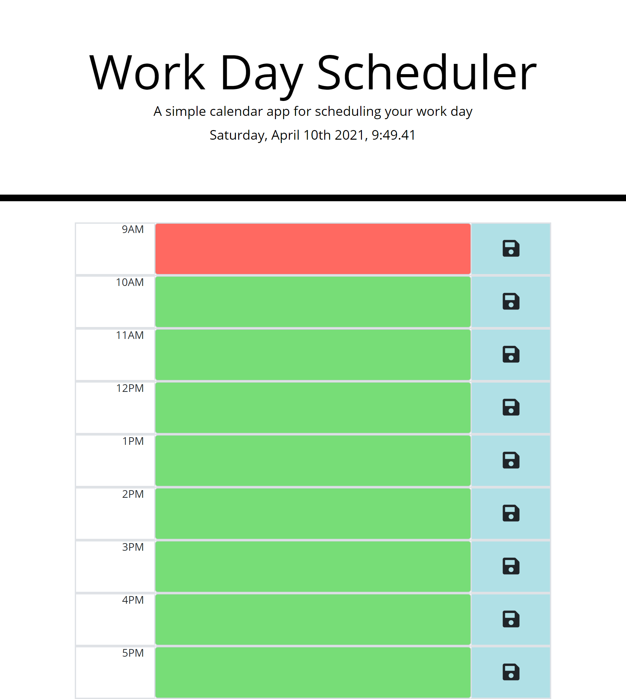

# work-day-scheduler

## Link of deployed application https://lufranckousse.github.io/work-day-scheduler/

## Github link  https://github.com/lufranckousse/work-day-scheduler.git

## Description

This application uses bootstrap, jQuery, HTML, CSS and javaScript to allow users to plan their work day. Input your schedule for each hour and the app will help you keep track of time by coloring each hour with colors for past, present, and future events.

## Usage

Click on the textarea of the timeslot you want to alter and type in your schedule for the hour. When you are done, click the save icon and everything you typed will be saved in local storage for later use.

## Technology Used

* HTML
* CSS
* JavaScript
* Bootstrap
* jQuery

## Screenshot

